MFA
================
Kaki
2018/5/28

load package and data
=====================

extract variables
=================

``` r
source("code/data_cleaning.R")
```

    ## Loading tidyverse: tibble
    ## Loading tidyverse: tidyr
    ## Loading tidyverse: readr
    ## Loading tidyverse: purrr
    ## Loading tidyverse: dplyr

    ## Conflicts with tidy packages ----------------------------------------------

    ## filter(): dplyr, stats
    ## lag():    dplyr, stats

    ## 
    ## Attaching package: 'lubridate'

    ## The following object is masked from 'package:base':
    ## 
    ##     date

``` r
char<-complete_df%>%
  select_if(~is.character(.x))
num<-complete_df%>%
  select_if(~is.numeric(.x))
```

there are 16 categorical variables and 60 numerical variables in the dataset.

group variables
===============

``` r
car<-num[23:60]%>%
  select(car_pings_since_agreement_start_channel_partner_csn, car_pings_since_agreement_start_country_code)

contract<-num[c(1:6,19)]

active<-num[c(10:13, 15:18,20:21)]

company<-num[c(7:9,14)]

order<-char[1:12]

segment<-char[13:16]

char_num<-bind_cols(c(order,segment,contract,active,company,car))
```

apply MFA
=========

``` r
res.MFA <-MFA(char_num, group = c(12,4,7,10,4,2), type = c(rep("n",2), rep("s",4)),
              ncp=5, name.group=c("order","segment","contract","active","company","car"))
```

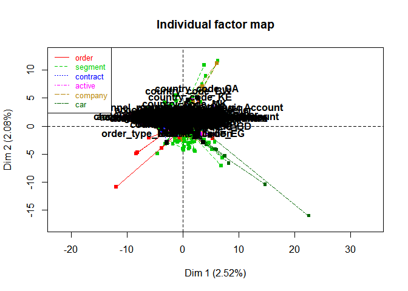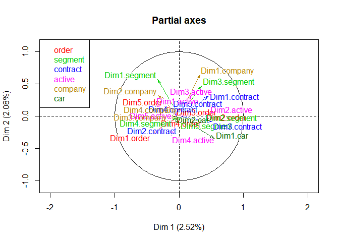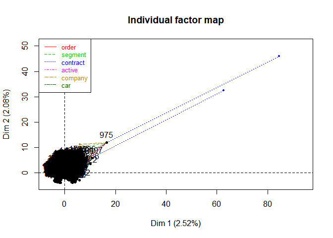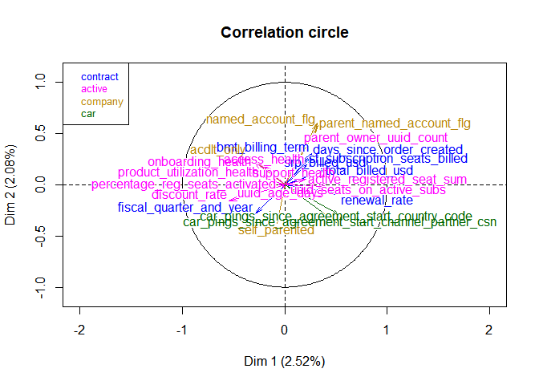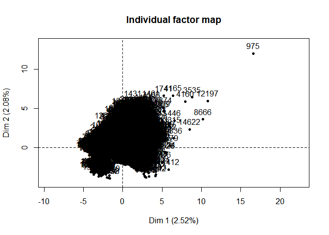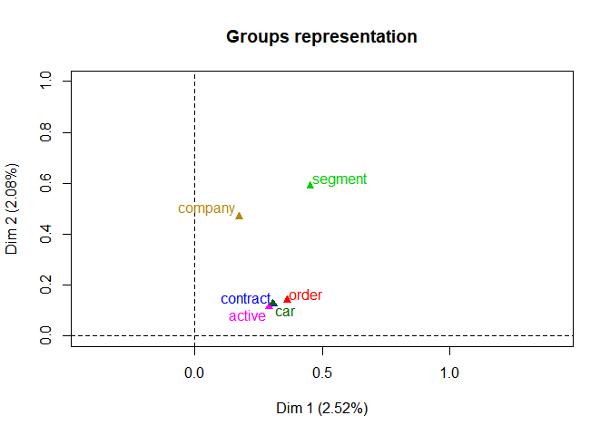

``` r
print(res.MFA)
```

    ## **Results of the Multiple Factor Analysis (MFA)**
    ## The analysis was performed on 15064 individuals, described by 39 variables
    ## *Results are available in the following objects :
    ## 
    ##    name                 description                                    
    ## 1  "$eig"               "eigenvalues"                                  
    ## 2  "$separate.analyses" "separate analyses for each group of variables"
    ## 3  "$group"             "results for all the groups"                   
    ## 4  "$partial.axes"      "results for the partial axes"                 
    ## 5  "$inertia.ratio"     "inertia ratio"                                
    ## 6  "$ind"               "results for the individuals"                  
    ## 7  "$quanti.var"        "results for the quantitative variables"       
    ## 8  "$quali.var"         "results for the categorical variables"        
    ## 9  "$summary.quanti"    "summary for the quantitative variables"       
    ## 10 "$summary.quali"     "summary for the categorical variables"        
    ## 11 "$global.pca"        "results for the global PCA"

Get eigenvalues/ variances
==========================

``` r
eig.val <- get_eigenvalue(res.MFA)
head(eig.val)
```

    ##       eigenvalue variance.percent cumulative.variance.percent
    ## Dim.1   1.893345         2.516082                    2.516082
    ## Dim.2   1.563891         2.078268                    4.594350
    ## Dim.3   1.458012         1.937564                    6.531915
    ## Dim.4   1.346688         1.789625                    8.321540
    ## Dim.5   1.170325         1.555254                    9.876794
    ## Dim.6   1.109934         1.475001                   11.351795

plot the percentage of explained variances for dimensions
=========================================================

``` r
fviz_screeplot(res.MFA)
```

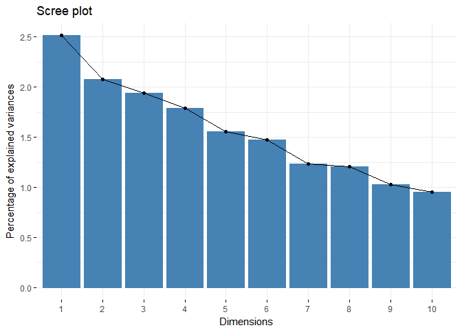

graph of variables
==================

group of variales
-----------------

``` r
group <- get_mfa_var(res.MFA, "group")
group
```

    ## Multiple Factor Analysis results for variable groups 
    ##  ===================================================
    ##   Name           Description                                          
    ## 1 "$coord"       "Coordinates"                                        
    ## 2 "$cos2"        "Cos2, quality of representation"                    
    ## 3 "$contrib"     "Contributions"                                      
    ## 4 "$correlation" "Correlation between groups and principal dimensions"

### plot the groups of variables

``` r
fviz_mfa_var(res.MFA, "group")
```

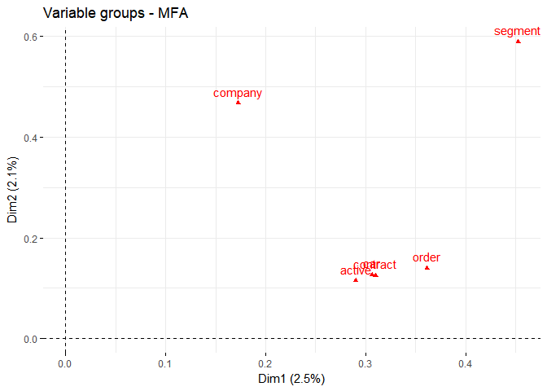

red color = active groups of variables green color = supplementary groups of variables The plot illustrates the correlation between groups and dimensions. The coordinates of the four active groups on the first dimension are almost identical. This means that they contribute similarly to the first dimension. "segment" contributes most to both dimension. Concerning the second dimension, "company"" have the second highest coordinates indicating a second highest contribution to the second dimension.

### draw a bar plot of groups contribution to the dimensions

``` r
fviz_contrib(res.MFA, "group", axes = 1)
```

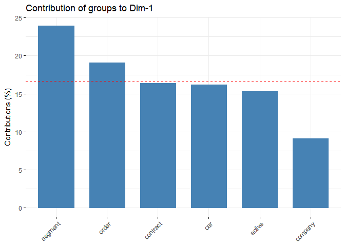

``` r
fviz_contrib(res.MFA, "group", axes = 2)
```

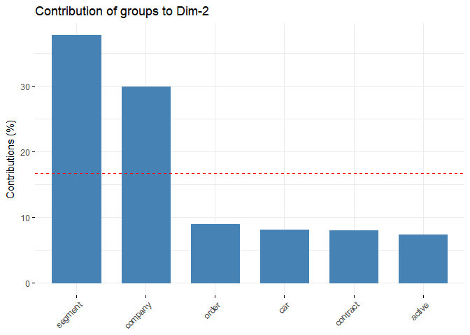

quantitative variables
----------------------

``` r
quantity<-res.MFA$quanti.var$contrib
quantity%>%abs()%>%View()

quanti.var <- get_mfa_var(res.MFA, "quanti.var")
quanti.var
```

    ## Multiple Factor Analysis results for quantitative variables 
    ##  ===================================================
    ##   Name       Description                      
    ## 1 "$coord"   "Coordinates"                    
    ## 2 "$cos2"    "Cos2, quality of representation"
    ## 3 "$contrib" "Contributions"

``` r
## Coordinates
head(quanti.var$coord)
```

    ##                                   Dim.1       Dim.2       Dim.3
    ## fiscal_quarter_and_year      -0.2880320 -0.28380142 -0.07039177
    ## bmt_billing_term              0.2641225  0.30236623  0.04270002
    ## srp_billed_usd                0.3910246  0.15292566 -0.25455938
    ## total_billed_usd              0.3854926  0.14345913 -0.25015565
    ## sf_subscription_seats_billed  0.2123312  0.19613195 -0.12783059
    ## renewal_rate                  0.5310418 -0.08955527 -0.13938617
    ##                                    Dim.4       Dim.5
    ## fiscal_quarter_and_year       0.52725806 -0.43135435
    ## bmt_billing_term             -0.60620074  0.36908109
    ## srp_billed_usd               -0.03173022  0.16391459
    ## total_billed_usd             -0.02401459  0.16499944
    ## sf_subscription_seats_billed  0.02224583  0.07297118
    ## renewal_rate                 -0.21836299 -0.38912466

``` r
## Cos2: quality on the factore map
head(quanti.var$cos2)
```

    ##                                   Dim.1       Dim.2       Dim.3
    ## fiscal_quarter_and_year      0.08296245 0.080543246 0.004955001
    ## bmt_billing_term             0.06976070 0.091425335 0.001823292
    ## srp_billed_usd               0.15290025 0.023386258 0.064800478
    ## total_billed_usd             0.14860453 0.020580523 0.062577848
    ## sf_subscription_seats_billed 0.04508452 0.038467742 0.016340660
    ## renewal_rate                 0.28200538 0.008020146 0.019428505
    ##                                     Dim.4       Dim.5
    ## fiscal_quarter_and_year      0.2780010583 0.186066572
    ## bmt_billing_term             0.3674793427 0.136220851
    ## srp_billed_usd               0.0010068070 0.026867994
    ## total_billed_usd             0.0005767005 0.027224814
    ## sf_subscription_seats_billed 0.0004948770 0.005324793
    ## renewal_rate                 0.0476823956 0.151417999

``` r
## Contributions to the dimensions
head(quanti.var$contrib)
```

    ##                                  Dim.1     Dim.2      Dim.3      Dim.4
    ## fiscal_quarter_and_year      1.5987755 1.8791369 0.12399905 7.53208347
    ## bmt_billing_term             1.3443636 2.1330246 0.04562793 9.95638325
    ## srp_billed_usd               2.9465521 0.5456197 1.62163402 0.02727815
    ## total_billed_usd             2.8637690 0.4801597 1.56601263 0.01562496
    ## sf_subscription_seats_billed 0.8688272 0.8974825 0.40892554 0.01340806
    ## renewal_rate                 5.4345466 0.1871163 0.48619896 1.29189359
    ##                                  Dim.5
    ## fiscal_quarter_and_year      5.8009315
    ## bmt_billing_term             4.2469092
    ## srp_billed_usd               0.8376539
    ## total_billed_usd             0.8487784
    ## sf_subscription_seats_billed 0.1660092
    ## renewal_rate                 4.7207052

### correlation between quantitative variables and dimensions

``` r
fviz_mfa_var(res.MFA, "quanti.var", palette = "jco", 
             col.var.sup = "violet", repel = TRUE)
```

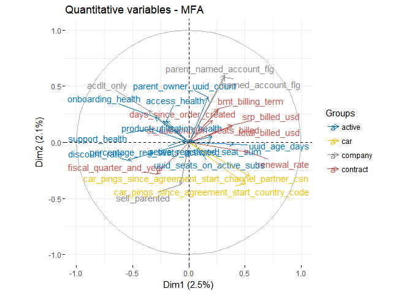

To make the plot more readable, we can use geom = c(“point”, “text”) instead of geom = c(“arrow”, “text”). We’ll change also the legend position from “right” to “bottom”, using the argument legend = “bottom”:

``` r
fviz_mfa_var(res.MFA, "quanti.var", palette = "jco", 
             col.var.sup = "violet", repel = TRUE,
             geom = c("point", "text"))
```

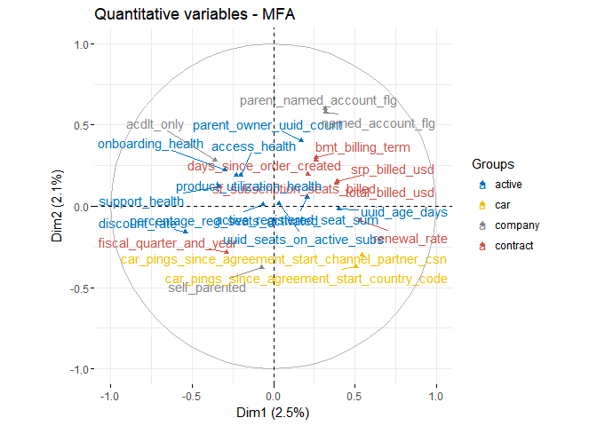 Briefly, the graph of variables (correlation circle) shows the relationship between variables, the quality of the representation of variables, as well as, the correlation between variables and the dimensions:

-   Positive correlated variables are grouped together, whereas negative ones are positioned on opposite sides of the plot origin (opposed quadrants).

-   The distance between variable points and the origin measures the quality of the variable on the factor map. Variable points that are away from the origin are well represented on the factor map.

-   For a given dimension, the most correlated variables to the dimension are close to the dimension.

For example, the first dimension represents the positive sentiments about activation: “renewal\_rate” and “total\_billed\_usd”. The most correlated variables to the second dimension are: i) parent\_named\_account\_flg for the company group; ii) parent\_owner\_uuid\_count for the activity group and

The contribution of quantitative variables (in %) to the definition of the dimensions can be visualized using the function fviz\_contrib() \[factoextra package\]. Variables are colored by groups. The R code below shows the top 20 variable categories contributing to the dimensions:

``` r
# Contributions to dimension 1
fviz_contrib(res.MFA, choice = "quanti.var", axes = 1, top = 20,
             palette = "jco", xtickslab.rt = 90)
```

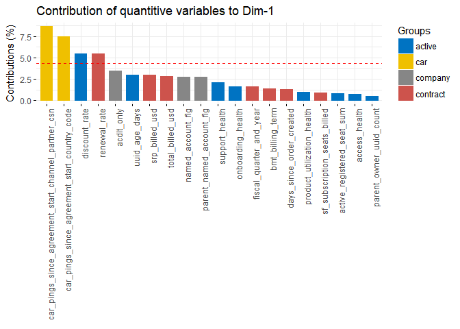

``` r
# Contributions to dimension 2
fviz_contrib(res.MFA, choice = "quanti.var", axes = 2, top = 20,
             palette = "jco", xtickslab.rt = 90)
```

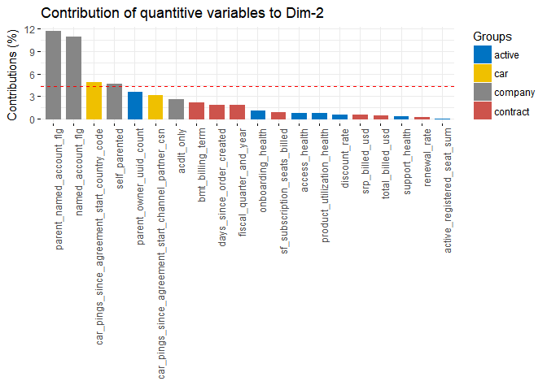

The red dashed line on the graph above indicates the expected average value, If the contributions were uniform. The calculation of the expected contribution value, under null hypothesis, has been detailed in the principal component analysis.

The most contributing quantitative variables can be highlighted on the scatter plot using the argument col.var = “contrib”. This produces a gradient colors, which can be customized using the argument gradient.cols.

``` r
fviz_mfa_var(res.MFA, "quanti.var", col.var = "contrib", 
             gradient.cols = c("#00AFBB", "#E7B800", "#FC4E07"), 
             col.var.sup = "violet", repel = TRUE,
             geom = c("point", "text"))
```

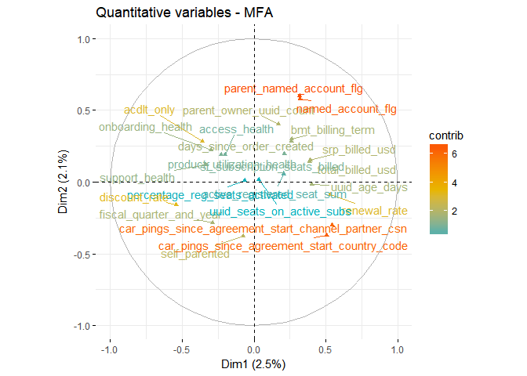

Similarly, we can highlight quantitative variables using their cos2 values representing the quality of representation on the factor map. If a variable is well represented by two dimensions, the sum of the cos2 is closed to one. For some of the row items, more than 2 dimensions might be required to perfectly represent the data.

``` r
# Color by cos2 values: quality on the factor map
fviz_mfa_var(res.MFA, col.var = "cos2",
             gradient.cols = c("#00AFBB", "#E7B800", "#FC4E07"), 
             col.var.sup = "violet", repel = TRUE)
```

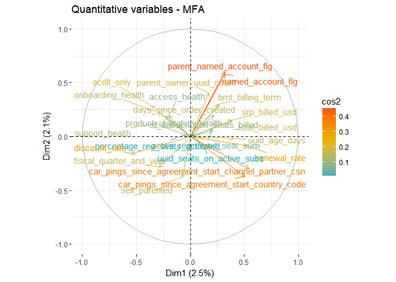

To create a bar plot of variables cos2, type this:

``` r
fviz_cos2(res.MFA, choice = "quanti.var", axes = 1)
```

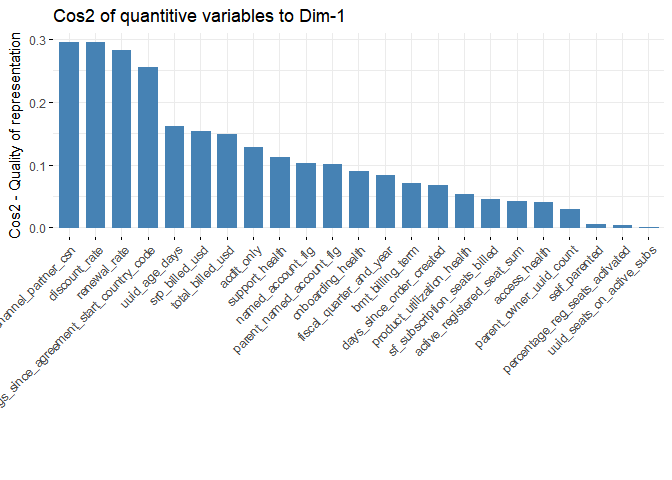 \#\# quantitative variables

``` r
fviz_mfa_var(res.MFA, "quali.var", col.var = "contrib",
             gradient.cols = c("#00AFBB", "#E7B800", "#FC4E07"), 
             col.var.sup = "violet", repel = TRUE,
             geom = c("point", "text"))
```

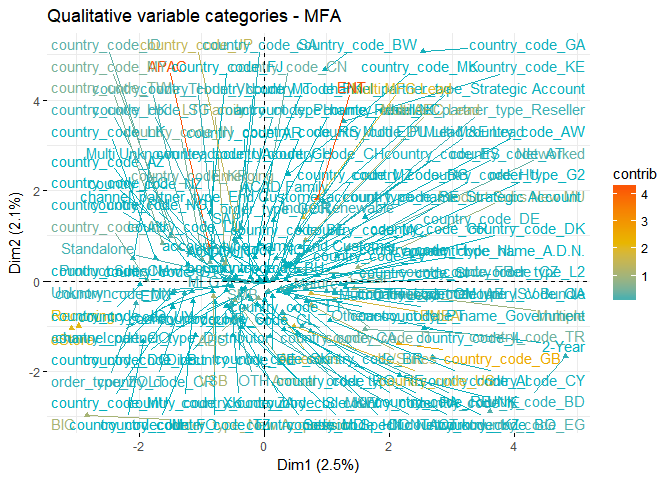 \#\# Graph of partial axes

The graph of partial axes shows the relationship between the principal axes of the MFA and the ones obtained from analyzing each group using either a PCA (for groups of continuous variables) or a MCA (for qualitative variables).

``` r
fviz_mfa_axes(res.MFA)
```

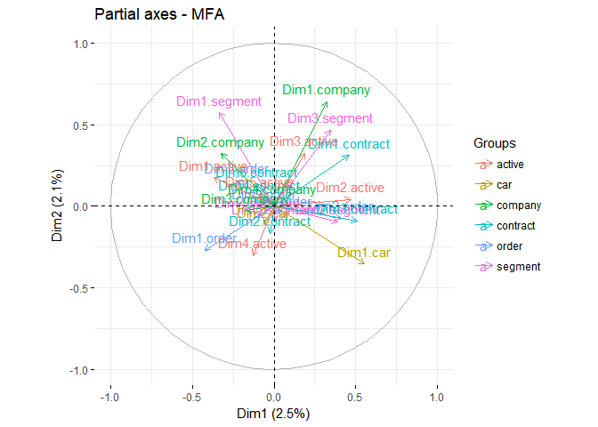

Summary
=======

The multiple factor analysis (MFA) makes it possible to analyse individuals characterized by multiple sets of variables. In this article, we described how to perform and interpret MFA using FactoMineR and factoextra R packages.

Further reading
===============

For the mathematical background behind MFA, refer to the following video courses, articles and books:

Multiple Factor Analysis Course Using FactoMineR (Video courses). <https://goo.gl/WcmHHt>. Exploratory Multivariate Analysis by Example Using R (book) (F. Husson, Le, and Pagès 2017). Principal component analysis (article) (Abdi and Williams 2010). <https://goo.gl/1Vtwq1>. Simultaneous analysis of distinct Omics data sets with integration of biological knowledge: Multiple Factor Analysis approach (Tayrac et al. 2009).
